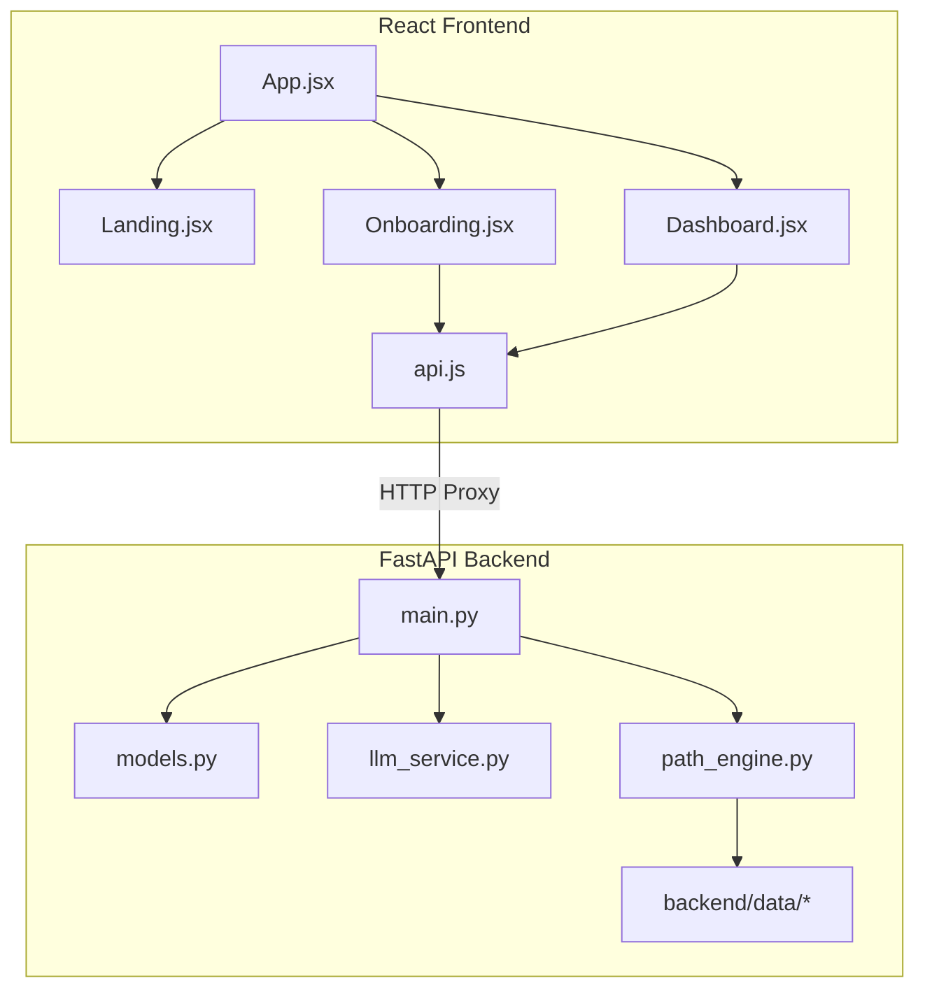

# 🧭 PathFinder AI — Codebase Architecture

This document serves as a high-level map of the codebase. It is designed to help AI coding agents (and humans) quickly understand how files and components interact without needing to scan every file, saving context window tokens.

---

## 🗺️ System Overview

The system consists of a **FastAPI backend** (Python) that handles data sorting and LLM extraction, and a **Vite + React frontend** (JavaScript) providing a dark glassmorphic user interface.

---

## 📦 Core Components & Communities

### 1. Path Recommendations Engine (`backend/path_engine.py`)
- **Purpose**: Parses clean datasets and constructs the prerequisite graph.
- **Key Methods**:
  - `PathEngine.generate_path(domain, target_skill_id, known_skills)`: Runs a topological sort on prerequisite chains.
  - `PathEngine.recommend_courses_for_skill(skill_id)`: Selects best-rated courses matching the skill.
  - `PathEngine.build_learning_plan(...)`: Generates full step-by-step milestone recommendations.

### 2. FastAPI Endpoints (`backend/main.py`)
- `/api/chat-intake` (POST): Passes free-text goals to `llm_service.py` to extract domain & skill fields.
- `/api/profile` (POST): Registers the learner profile.
- `/api/path` (POST): Triggers path generation via `PathEngine`.
- `/api/explain` (POST): Generates customized, grounded explanations for recommendations using `llm_service.py`.
- `/api/resources/for-path` (POST): Returns free resources for all skills on a path, optionally filtered by format.
- `/api/progress` (POST): Updates marked-off milestones and recalculates the remaining path.

### 3. LLM Wrapper Service (`backend/llm_service.py`)
- **Model**: `llama-3.3-70b-versatile` (via Groq API).
- **Functions**:
  - `extract_intake_json(...)`: Uses system prompt constraints to force JSON outputs matching only valid skills in our graph.
  - `explain_recommendation(...)`: Grinds explanations from the exact prerequisite chain to prevent hallucinations.
  - `explain_resources_batch(...)`: Produces resource-fit explanations for a path in one request; source descriptions remain available as a fallback.

### Free-resources layer

`backend/data/free_resources_mapping.json` is intentionally independent of `course_skill_mapping.json`. `PathEngine` loads it as a separate resource index, validates every mapped skill ID at startup, and filters results by format before the dashboard renders its resource cards.

### 4. React Frontend (`frontend/src/`)
- `api.js`: Standardized helper using relative paths mapped to the Vite development server proxy.
- `index.css`: Implementation of the custom design system (dark glassmorphism, glowing borders, custom typography).
- `pages/Dashboard.jsx`: Coordinates milestones, updating progress trackers, and rendering course chips.
